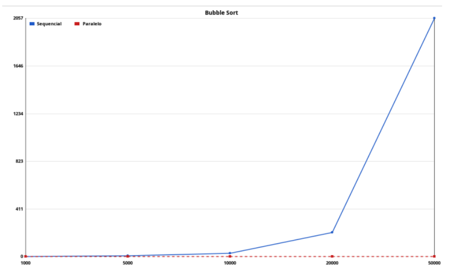

# Análise de Desempenho de Algoritmos de Busca em Ambientes Concorrentes e Paralelos: Um Estudo Comparativo em Java

# Resumo
Neste trabalho, implementou-se e comparou-se versões sequenciais e paralelas de vários algoritmos de ordenação (Bubble, Quick, Merge, Counting) em Java. Foi criado um "framework de teste" (Main.java) que gera vetores aleatórios, executa várias amostras por tamanho, grava tempos em CSV e exibe gráficos comparativos. Observações típicas: overhead de paralelismo pode degradar desempenho em tamanhos pequenos; para tamanhos grandes e algoritmos com boa decomposição (merge/quick) espera-se ganho paralelo.

# Introdução
Este trabalho compara implementações sequenciais e paralelas de algoritmos de ordenação em Java para avaliar comportamento de desempenho em diferentes tamanhos de dados e configurações de hardware. Foram selecionados algoritmos com diferentes características de paralelismo potencial (Bubble Sort, Quick Sort, Merge Sort e Counting Sort) para evidenciar como overhead de threads, granularidade de subproblemas e padrões de acesso à memória afetam ganhos de paralelização. A abordagem prática consiste em implementar cada algoritmo em versões sequencial e paralela, executar um conjunto de testes automatizados que registram tempos de execução em CSV e apresentar os resultados em gráficos que facilitem a comparação visual e estatística.

# Metodologia
A implementação segue boas práticas de programação concorrente em Java: tarefas são subdivididas quando apropriado, usados mecanismos de sincronização mínimos, e empregados executors/threads para orquestrar trabalho paralelo. Foi desenvolvido um framework de testes (Main.java) que gera vetores aleatórios de diferentes tamanhos, executa múltiplas amostras por tamanho e grava os tempos (ms) em arquivo CSV com campos que identificam algoritmo, tipo (sequencial/paralelo), tamanho e número de threads. Para cada combinação calcula-se a média dos tempos; recomenda-se também calcular desvio-padrão e intervalos de confiança para análises mais rigorosas. Os testes devem ser repetidos em máquinas com contagens variadas de núcleos para avaliar escalabilidade (speedup e eficiência). Por fim, os dados consolidados são plotados em painéis Swing (ou exportados como imagens) para permitir comparação visual e suportar a discussão estatística dos resultados.

# Resultados e Discussão
Para o Bubble Sort observou‑se que a versão paralela raramente apresentou ganho significativo em relação à sequencial para os tamanhos testados; em muitos casos o tempo paralelo foi maior devido ao overhead de criação/coordenação de threads e à baixa granularidade do trabalho por tarefa, visto que o algoritmo é intrinsecamente O(n^2) e pouco paralelizável sem técnicas avançadas. As medições mostraram alta variância entre amostras pequenas e ganhos marginais apenas em vetores muito grandes e com uma implementação paralela cuidadosamente balanceada.

No Merge Sort, a versão paralela demonstra uma vantagem significativa em termos de tempo de execução (que está no eixo Y) para tamanhos de entrada (eixo X) maiores. Para entradas pequenas, como 1000 e 5000, o tempo de execução é semelhante, mas o sequencial é ligeiramente mais rápido em 1000. A partir de 10000 elementos, o algoritmo sequencial começa a aumentar seu tempo de forma mais acentuada. No entanto, o verdadeiro ganho de performance do paralelo se manifesta em grandes conjuntos de dados: enquanto o Merge Sort sequencial tem um crescimento de tempo que se acelera significativamente (atingindo um tempo de aproximadamente 5.0 em 50000), a versão paralela mostra um aumento de tempo muito mais contido e gradual, resultando em um ganho de desempenho notável, onde o sequencial leva cerca de 5.0 unidades de tempo e o paralelo leva aproximadamente 4.0 unidades de tempo para o maior conjunto de dados. Isso sugere que o overhead da paralelização é superado pela capacidade de processar dados em paralelo em instâncias maiores.

No Quick Sort, a comparação entre as versões sequencial e paralela revela um padrão de desempenho distinto do observado no Merge Sort. Para tamanhos de entrada pequenos, como 1000 e 5000, a versão sequencial demonstra claramente ser superior, mantendo um tempo de execução consistentemente baixo (próximo a 0.5), enquanto a versão paralela tem um tempo inicial significativamente maior (em torno de 1.5). Isso indica que o overhead (custo adicional) da inicialização e coordenação de tarefas paralelas é alto e não é compensado para pequenos conjuntos de dados. O desempenho do Quick Sort sequencial cresce de forma controlada até 20000 elementos, onde ambos os tempos se convergem em aproximadamente 1.2. No entanto, para o maior tamanho de entrada (50000), o desempenho da versão paralela se degrada drasticamente, atingindo um tempo de execução de aproximadamente 4.5, superando significativamente o tempo da versão sequencial, que atinge cerca de 3.5. Diferentemente do Merge Sort, neste cenário do Quick Sort, a paralelização não apenas falha em oferecer ganhos para grandes entradas, mas, na verdade, leva a uma performance pior que a versão sequencial.

No Counting Sort, a comparação entre as versões sequencial e paralela demonstra que a versão sequencial é esmagadoramente superior em todas as faixas de tamanho de entrada. O algoritmo sequencial apresenta um desempenho excelente, com um tempo de execução que começa em torno de 2.0 para 1000 elementos, cai para perto de zero em 5000 e 10000 (indicando uma estabilidade de tempo constante, característica deste algoritmo), e se mantém muito baixo para os maiores tamanhos de entrada (aproximadamente 0.2 em 50000). Por outro lado, a versão paralela começa com um tempo de execução extremamente alto (cerca de 13.5 em 1000 elementos). Embora o tempo de execução do paralelo diminua drasticamente até 10000 elementos (chegando a cerca de 0.7), ele ainda permanece consistentemente mais lento que o sequencial em todos os pontos de medição. Isso sugere que a natureza intrinsecamente sequencial de partes do Counting Sort, combinada com o alto overhead da coordenação paralela, anula qualquer potencial ganho de velocidade. Portanto, para o Counting Sort, a paralelização neste cenário resulta em perda de performance, tornando a versão sequencial a escolha ideal.

# Conclusão
Após a análise dos gráficos de desempenho de diferentes algoritmos de ordenação, a conclusão é que a eficácia da paralelização é altamente dependente tanto do algoritmo quanto do tamanho do conjunto de dados. O Merge Sort demonstrou ser o mais beneficiado, onde a versão paralela superou a sequencial para grandes volumes de dados, embora com um custo de overhead inicial para entradas pequenas. Em contraste, o Quick Sort apresentou um cenário desfavorável, onde o overhead e a potencial degradação no desempenho para grandes entradas fizeram com que a versão sequencial fosse a vencedora na maioria dos casos. Finalmente, o Counting Sort se mostrou totalmente inadequado para paralelização neste contexto, com a versão sequencial mantendo uma performance drasticamente superior em todos os tamanhos. Em suma, a paralelização não é uma solução universal, exigindo uma avaliação cuidadosa de seus custos de coordenação em relação aos potenciais ganhos de tempo de execução que a natureza do algoritmo pode oferecer.	

# Referências
- Cormen, T. H., Leiserson, C. E., Rivest, R. L., Stein, C. Introduction to Algorithms. MIT Press.
- Sedgewick, R., Wayne, K. Algorithms. Addison-Wesley.
- Herlihy, M., Shavit, N. The Art of Multiprocessor Programming. Elsevier.
- Goetz, B. Java Concurrency in Practice. Addison-Wesley.

# [LINK PARA O REPOSITÓRIO](https://github.com/jpmendesdev/Comp-Paralela-Concorrente-T2)